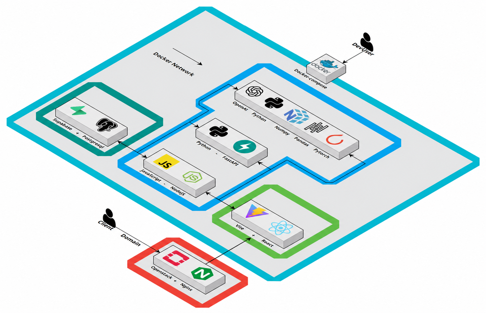
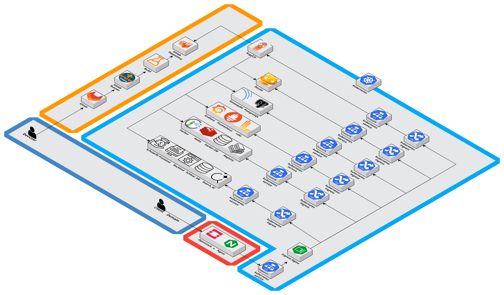

<div align="center">

# 🎓 ScholarFit

**데이터 기반 통합 장학금 필터링 플랫폼**

흩어진 장학 공고를 모으고, 학생별 자격을 판정하여
*검색*에서 *실제 지원*으로 이어지게 만드는 대학 친화형 플랫폼

[](https://scholarfit.chosuncnl.cloud/)
[](https://www.figma.com/design/D9xupjqJyLqWqTndzPDSeB/Wireflow?node-id=0-1)

</div>

---

## 📑 목차

1. [프로젝트 소개](#-프로젝트-소개)
2. [팀 소개](#-팀-소개)
3. [기술 스택](#️-기술-스택)
4. [시스템 아키텍처](#️-시스템-아키텍처)
5. [핵심 기능](#-핵심-기능)
6. [시작하기](#-시작하기)
7. [추진 일정 & KPI](#️-추진-일정)
8. [트러블슈팅](#-트러블슈팅)
9. [사용자 피드백](#-사용자-피드백)

---

## 🎯 프로젝트 소개

### 문제 정의

> 장학 정보가 **공공기관·대학·지자체·민간**에 분산되어 있어,
> 학생은 자신에게 맞는 장학금을 찾기 위해 여러 사이트를 반복 방문해야 합니다.

설문조사 결과 (n=39), 사용자들이 가장 불편하게 느낀 점:

| 순위 | 불편 사항 | 응답률 |
|:---:|---|:---:|
| 🥇 | 여러 사이트를 일일이 돌아다녀야 함 | `71.8%` |
| 🥈 | 내 조건에 맞는지 파악이 복잡함 | `64.1%` |
| 🥉 | 공고를 늦게 확인해 마감일을 놓침 | `41.0%` |

<br>

### 해결 방안

<table>
<tr>
<td width="25%" align="center">🔍<br><b>통합 탐색</b></td>
<td>공공·교내·지자체·민간 공고를 <b>하나의 스키마</b>로 통합</td>
</tr>
<tr>
<td align="center">🤖<br><b>설명가능 추천</b></td>
<td>규칙 엔진 + LLM 보조 해석으로 <b>"왜 추천되었는지"</b> 명시</td>
</tr>
<tr>
<td align="center">📅<br><b>행동 전환</b></td>
<td>추천 → 체크리스트 → <b>Google Calendar 등록</b>까지 연속 지원</td>
</tr>
<tr>
<td align="center">🛡️<br><b>신뢰 설계</b></td>
<td>원문 링크·업데이트 시각·근거 문장·<b>신뢰 등급</b> 제공</td>
</tr>
</table>

<br>

### 검증된 성과

<div align="center">

| 지표 | 결과 |
|---|---|
| ⚡ **탐색 시간** | 78.9% 의 사용자가 `1~3분` 이내에 장학금 발견 |
| ⭐ **시간 단축 체감** | `92.1%` 가 5점 만점에 4~5점 부여 |
| 💡 **가장 도움이 된 기능** | 프로필 맞춤 필터링 `52.6%` |

</div>

---

## 👥 팀 소개

<table align="center">
<tr>
<th width="20%">조찬형 (팀장)</th>
<th width="20%">강휘민</th>
<th width="20%">한고은</th>
<th width="20%">여수연</th>
</tr>
<tr>
<td align="center">
<sub>20213061</sub><br><br>
<b>프로젝트 총괄</b><br><br>
API · AI 리드<br>
사용자 화면 설계<br>
규칙 엔진 / 자소서 첨삭<br>
</td>
<td align="center">
<sub>20213075</sub><br><br>
<b>인프라 · 배포</b><br><br>
OpenStack<br>
Nginx · CI/CD<br>
모니터링 · 장애 대응<br>
</td>
<td align="center">
<sub>20233132</sub><br><br>
<b>DB · 데이터 · 인증</b><br><br>
DB 설계<br>
API 연동 · 데이터 수집<br>
Google OAuth · Calendar<br>
</td>
<td align="center">
<sub>20233063</sub><br><br>
<b>서비스 · UX</b><br><br>
추천 플로우<br>
필터링 로직<br>
검색 엔진<br>
</td>
</tr>
</table>

<div align="center"><sub>🏫 조선대학교 산학프로젝트1 · 2026</sub></div>

---

## 🛠️ 기술 스택

### Frontend


### Backend & AI


### Database


### Data Collection


### Infrastructure & DevOps


### Observability & Quality


---

## 🏗️ 시스템 아키텍처

### 분석 파이프라인

```
📥 수집  →  🔄 구조화  →  ⚙️ 판정  →  💬 설명  →  🚀 행동
크롤링    공통 스키마    규칙엔진    RAG       체크리스트
         정규화        + LLM      근거문장   캘린더
```

### 2단계 판정 엔진

```
┌─────────────────────────────────────────────────┐
│  1️⃣ 규칙 엔진 (Rule-based)                       │
│     GPA · 학년 · 지역 · 소득구간 → 즉시 판정      │
└─────────────────────┬───────────────────────────┘
                      ↓
┌─────────────────────────────────────────────────┐
│  2️⃣ LLM 보조 해석                                │
│     예외 조항 · 우대 문구 · 서술형 자격           │
│     → 환각 방지 위해 "검토 필요" 상태 분리        │
└─────────────────────────────────────────────────┘
```

### 환경 분리

<table>
<tr>
<th width="50%">🧪 Dev 환경</th>
<th width="50%">🚀 Ops 환경</th>
</tr>
<tr>
<td align="center">

</td>
<td align="center">

</td>
</tr>
<tr>
<td>

`/home/devuser/repo/app`

- **Docker Compose** 기반
- 빠른 빌드 & 배포 우선
- Vite + React (Frontend)
- FastAPI + Node.js (Backend)
- OpenAI + PyTorch (AI)
- Supabase + PostgreSQL

</td>
<td>

`/home/ubuntu/repo/infra-repo`

- **Kubernetes** 기반
- 자동 복구 & 무중단
- GitLab CI → ArgoCD → K8s
- Harbor (Image Registry)
- Ingress-nginx + Service
- Grafana + Prometheus + Loki

</td>
</tr>
</table>

<details>
<summary><b>📡 네트워크 흐름 자세히 보기</b></summary>

**개발 환경**
```
Client → DNS → OpenStack Nginx (Reverse Proxy)
       → VM IP : External Port
       → Container : Inner Port
```

**운영 환경**
```
Client → DNS → OpenStack Nginx (Reverse Proxy)
       → Node IP : NodePort
       → kube-proxy (L4 LB)
       → Ingress-nginx (L7 Router)
       → Service → Pod → Application
```

</details>

---

## 🌐 인프라 서비스

조선대학교 사설 클라우드 (`*.chosuncnl.cloud`) 위에 구축된 운영 인프라

| 서비스 | 용도 | 링크 |
|:---:|---|:---:|
| 🌥️ **OpenStack** | 프라이빗 클라우드 플랫폼 | [↗](https://chosuncnl.cloud/) |
| 🗄️ **Supabase** | DB + Auth (BaaS) | [↗](https://supabase.chosuncnl.cloud/) |
| 🔍 **SonarQube** | 정적 코드 분석 | [↗](https://sonar.chosuncnl.cloud/) |
| 📊 **Grafana** | 모니터링 (+ Prometheus, Loki) | [↗](https://grafana.chosuncnl.cloud/) |
| 🚀 **ArgoCD** | GitOps 자동 배포 | [↗](https://argo-cd.chosuncnl.cloud/) |
| 📦 **Harbor** | Container Image Registry | [↗](https://harbor.chosuncnl.cloud/) |
| 📜 **Dozzle** | 실시간 Log Viewer | [↗](https://dozzle.chosuncnl.cloud/) |
| 🔔 **Alert** | 알림 서비스 | [↗](https://alert.chosuncnl.cloud/) |

---

## ✨ 핵심 기능

| 기능 | 설명 |
|---|---|
| 👤 **프로필 온보딩** | 학년·성적·거주지·소득구간·전공·희망 장학 유형을 1회 입력 |
| 📥 **공고 통합 수집** | 공식·교내·지자체·민간 공고를 공통 스키마로 자동 정규화 |
| 🤖 **AI 요건 해석** | 명시 조건은 규칙 기반, 서술형은 LLM 보조 → `지원가능 / 검토필요 / 부적합` |
| 🏆 **추천 · 랭킹** | 적합도 · 마감 임박도 · 장학 규모 · 중복 가능성을 종합 점수화 |
| 📅 **일정 · 알림** | D-7 / D-3 / D-1 / D-Day Google Calendar 등록 |
| 🛠️ **관리자 대시보드** | 수집 상태·오류 감지·수동 보정·우선 노출 |

---


## 📁 디렉터리 구조

```
📦 devuser/repo/app                 # 개발 공간
 ┣ 📂 backend
 ┃ ┣ 📂 Afunction
 ┃ ┃ ┣ 🐳 Dockerfile
 ┃ ┃ ┗ 📂 src/
 ┃ ┗ 📂 Bfunction
 ┣ 📂 frontend
 ┃ ┣ 🐳 Dockerfile
 ┃ ┗ 📂 src/
 ┣ 📂 exec/sql
 ┃ ┗ 📜 init.sql
 ┗ 🐳 docker-compose.yml

📦 ubuntu/repo/infra-repo           # 운영 공간
 ┣ 📂 ansible/                      # IaC (server, nginx, k8s 설치)
 ┗ 📂 devops-platform/              # GitOps + k8s 관리
   ┣ 📂 argocd-apps/
   ┣ 📂 env/
   ┣ 📂 namespaces/
   ┗ 📂 platform/
```

---

## 🗓️ 추진 일정

12주 단계형 스프린트로 운영

| 주차 | 작업 패키지 | 담당 |
|:---:|---|:---:|
| `W1` | 요구사항 정제 · 정보원 목록화 | 찬형 · 휘민 |
| `W1-W2` | DB 스키마 · API 명세 | 고은 · 찬형 |
| `W2-W4` | 수집기 · 정규화 파이프라인 | 휘민 · 고은 |
| `W3-W6` | AI 추출 · 매칭 엔진 | 찬형 · 수연 |
| `W4-W7` | UI/UX · 프로필 온보딩 | 수연 · 찬형 |
| `W6-W8` | 일정 연동 · 알림 | 고은 |
| `W7-W10` | 관제 · 품질 · 배포 | 휘민 |
| `W10-W12` | 통합 테스트 · 파일럿 피드백 | 전체 |

<br>

### 평가 지표 (KPI)

| 영역 | 목표 |
|---|---|
| 📊 공고 구조화 정확도 | F1 `0.90` 이상 |
| ✅ 자격 판정 일치도 | `85%` 이상 |
| ⚡ 추천 응답 속도 (P95) | `1.0초` 이하 |
| 🔔 알림 성공률 | `99%` 이상 |
| 🔄 데이터 최신성 | `6시간` 이내 갱신 |
| ⭐ 사용자 만족도 | `4.2 / 5.0` 이상 |

---

## 🐛 트러블슈팅

프로젝트 진행 중 해결한 주요 이슈들

<details>
<summary>🎨 <b>Frontend</b></summary>

<br>

**신입생 선택 시 저장 버튼이 안 뜨는 버그**
- 신입생은 성적 입력 단계를 건너뛰는데, 이때 저장 버튼이 함께 사라짐
- → 신입생의 경우 별도 분기로 저장 버튼이 표시되도록 처리

**성적 입력 검증 미흡**
- 만점 초과 입력 차단
- 어학 성적은 점수 직접 입력 대신 **등급 선택** 방식으로 변경
- 음수 / 과학적 표기법 차단, 소수점 검증 개선

</details>

<details>
<summary>⚙️ <b>Backend</b></summary>

<br>

**API 엔드포인트 변경 시 수집 실패**
- 실행 시작 시점에만 UDDI를 조회 → 중간에 주소가 바뀌면 다음 수집 실패
- → 수집할 때마다 최신 엔드포인트 반영 + 실패 시 즉시 재갱신

**Google Calendar 작동 안 됨**
- CSP(콘텐츠 보안 정책)가 Google 로그인 스크립트를 차단
- → CSP 허용 목록에 Google 도메인 추가

**로그인 후 프로필 저장 안 됨**
- 페이지 새로고침마다 함수가 중복 호출 → 비정상 접근으로 차단
- → 세션 복원 시 UI만 복원, 실제 로그인 시에만 1회 호출

</details>

<details>
<summary>🤖 <b>AI</b></summary>

<br>

**Gemini API RPM 초과**
- Free Tier 제한으로 120개 데이터 한꺼번에 전송 시 분당 요청 제한 초과
- → **10개씩 배치 처리** + 에러 시 `time.sleep(20)` 후 자동 재시도

**지역 필터링 오류**
- `city` 없이 `district`만 올 때 필터가 통째로 스킵 → 타 지역 장학금 노출
- → `user_location_names` set으로 교체, `qualification` 텍스트에서 시/군 지명 추출 후 strict match

**5학년(초과학기) 선택 시 422 에러**
- `grade` 검증이 `le=4`로 막혀 있었고, 코드가 이미 이미지에 빌드됨
- → `le=8`로 수정 후 Docker 이미지 재빌드 + 컨테이너 재생성

</details>

<details>
<summary>🛠️ <b>Infra</b></summary>

<br>

**디스크 용량 부족**
- → Cinder 50GB 추가 부여 + Docker volume path 변경

**사용자 권한 문제**
- 서버에서 사용자별 권한을 나누다 보니 일부 막히는 곳이 존재.
- → 그룹권한으로 변환하여 권한 관리


</details>

---

## 💬 사용자 피드백

<table>
<tr>
<td>

> 💌 *"제 인생은 스칼라핏을 알게 된 것을<br>기점으로 크게 바뀌게 되었습니다."*

</td>
<td>

> 🔥 *"이건 혁명이야!"*

</td>
<td>

> ⚡ *"빠른 시간 내에 찾을 수 있어서<br>수고로움이 줄어든 점이 좋다."*

</td>
</tr>
</table>


---

## 📚 참고 자료

- [한국장학재단 공공데이터 API](https://www.data.go.kr/data/15028252/fileData.do)
- [교육부 — 국가장학금 통합신청 안내](https://www.moe.go.kr/)
- [드림스폰](https://www.dreamspon.com/)
- [조선대학교 장학안내](https://www3.chosun.ac.kr/sites/scho/index.do)
- 이필남·곽진숙 (2013). 「국가장학금이 대학생의 근로 및 학업활동에 미치는 영향」, *교육재정경제연구*, 22(4)
- 이지혜·김지연 (2023). 「민간 장학재단의 장학생 경험 분석」, *평생학습사회*, 19(4)

---

<div align="center">

**🎓 ScholarFit · 조선대학교 산학프로젝트1 · 2026**

<sub>장학 정보 탐색에서 실제 신청까지, 한 화면에서.</sub>

</div>